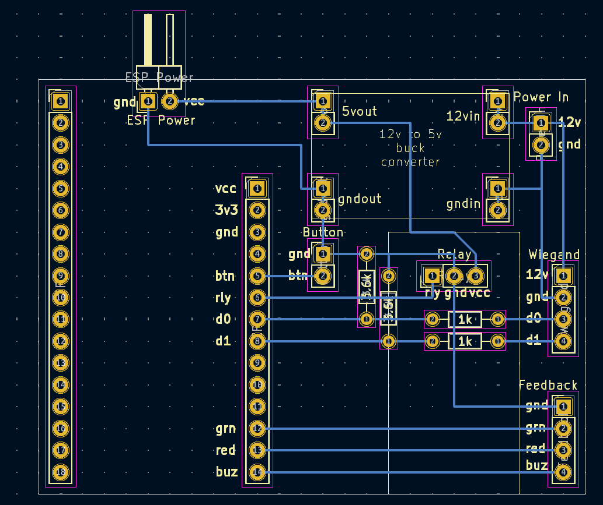

# Firebeetle ESP32-e

Product Page: https://www.dfrobot.com/product-2195.html
Wiki: https://wiki.dfrobot.com/FireBeetle_Board_ESP32_E_SKU_DFR0654

# Image

# Components
- 1x Firebeetle ESP32-e
- 1x [5v relay board](https://www.switchelectronics.co.uk/products/5v-1-channel-low-level-trigger-relay-module-with-optocoupler)
- 1x 10k resistor
- 1x 5.1k resistor
- 3x 4x1 2.54mm header
- 1x 2x1 2.54mm header

# Notes
- The ESP Power header in the top left is a place holder for wires that connect from the two Vias to the FireBeetle's 
  VIN and GND pads underneath its usb port.
- The FireBeetle and relay are expected to be soldered directly to the board.
- The Relay is connected via a 5.1k resistor to lower the current draw as so it can reach the required 5v.
- A ground pin is provided next to the feedback for when using them to power outputs. When all these pins are inverted
  this ground pin can be ignored.
