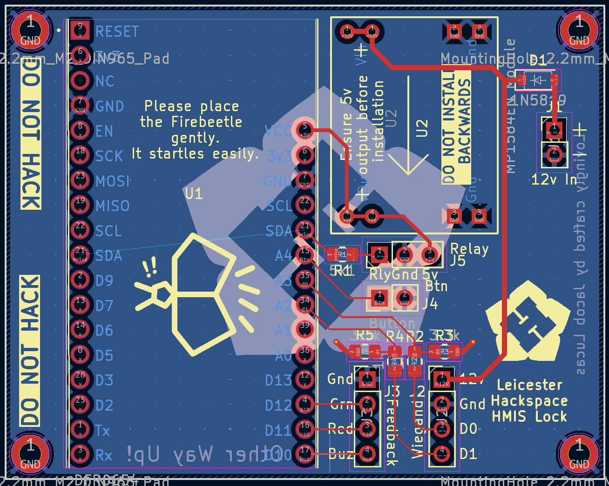

# Firebeetle ESP32-e Surface Mount Design

Product Page: https://www.dfrobot.com/product-2195.html
Wiki: https://wiki.dfrobot.com/FireBeetle_Board_ESP32_E_SKU_DFR0654

# Image

# Components
- 1x Firebeetle ESP32-e
- 1x [5v relay board](https://www.switchelectronics.co.uk/products/5v-1-channel-low-level-trigger-relay-module-with-optocoupler)
- 1x [12v to 5v buck converter](https://www.aideepen.com/products/dc-dc-usb-9v-12v-19v-to-5v-3a-step-down-buck-converter-power-supply-charger-module-voltage-regulator-for-vehicle-car-board)
  - https://kunkune.co.uk/shop/dc-to-dc-converters/small-adjustable-power-supply-step-down-module-mp1584en/
  - https://www.mpja.com/Micro-Adjustable-Step-Down-Buck-DC_DC-Converter-3A/productinfo/35371%20PS/
  - https://www.aliexpress.com/item/1005005870392716.html?spm=a2g0o.order_list.order_list_main.193.254618024ZJA2j
  - https://www.aideepen.com/products/dc-dc-usb-9v-12v-19v-to-5v-3a-step-down-buck-converter-power-supply-charger-module-voltage-regulator-for-vehicle-car-board
- 1x SOD-123 1N5819 Schottkey Diode
- 1x 805 5.1k resistor (Optional for relay)
- 2x 805 1k resistor
- 2x 805 3.3k resistor
- 2x 4x1 2.54mm header
- 1x 3x1 2.54mm header
- 6x 2x1 2.54mm header

# Notes
- The ESP and relay are powered using a 12v to 5v buck converter daughter board
  - None of the boards listed perfectly fit 2.54mm spacing
  - There are a few similar boards that use the MP1584, not all will fit the spacing on the PCB
- The buck converter is expected to be soldered directly to the board.
- The Relay has an optional resistor incase you need to lower the current draw, a 5.1k resistor is suggested for the 
  linked relay.
  - If not using this, you should bridge the gap with solder or a 0 ohm resistor
- A ground pin is provided next to the feedback for when using them to power outputs. When all these pins are inverted
  this ground pin can be ignored.
- A voltage divider is used to step down the the Wiegand data lines from 5v to 3v3 to prevent damage to the esp.
  - The voltage divider in particular was used due to protocol being one way, and a logic level shifter being impractical 
    due to the lack of access to the 5v rail at the wiegand side
- The button is using an internal pull-up resistor
